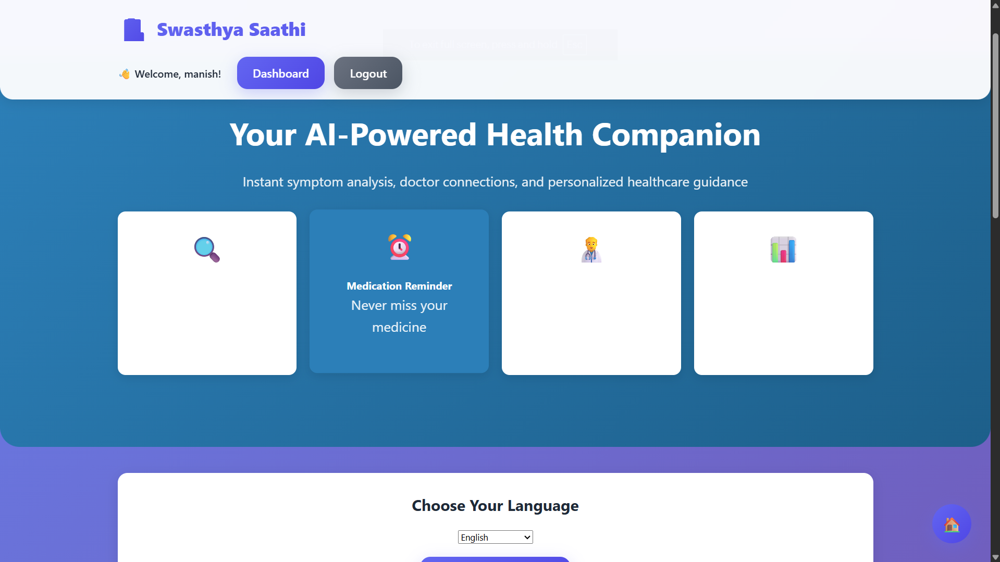
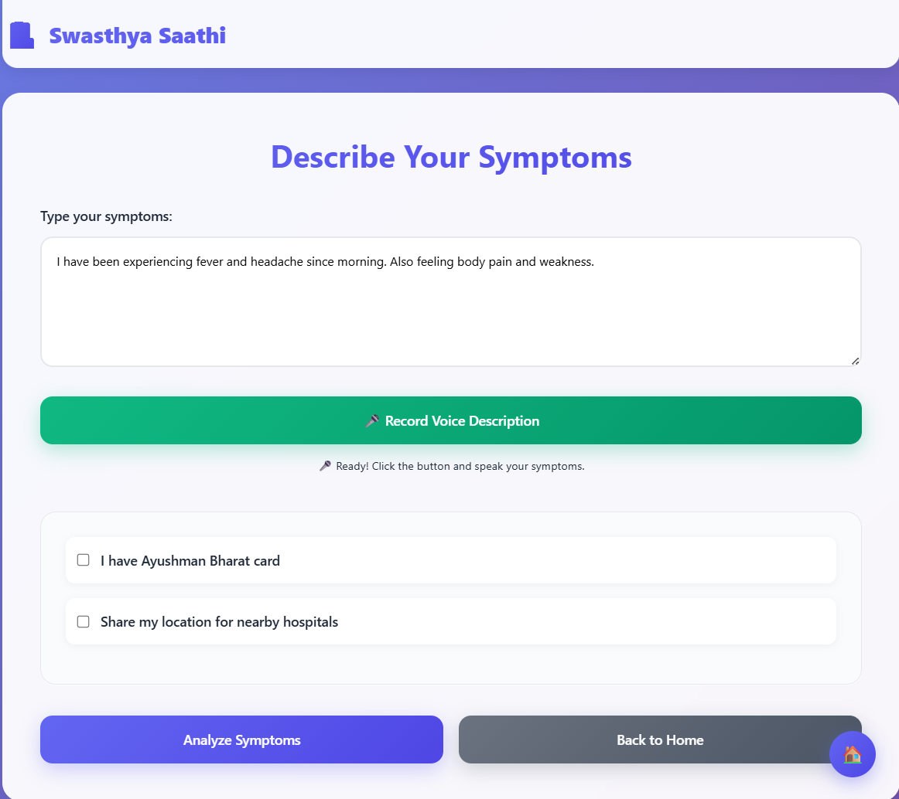
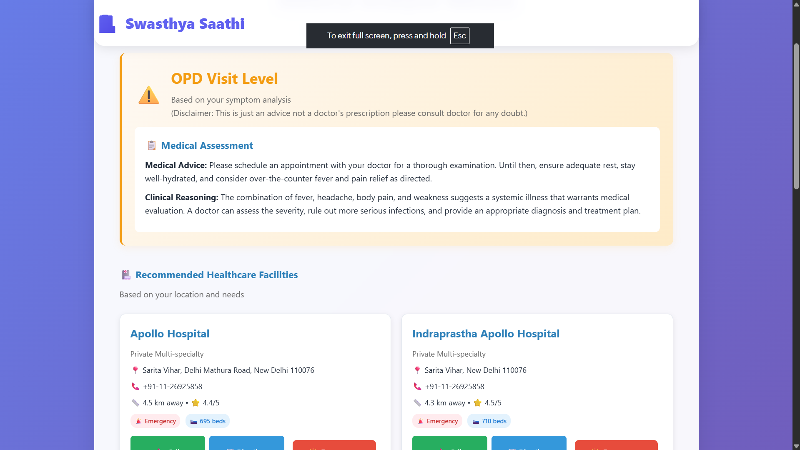
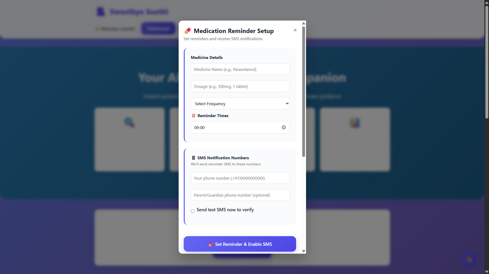
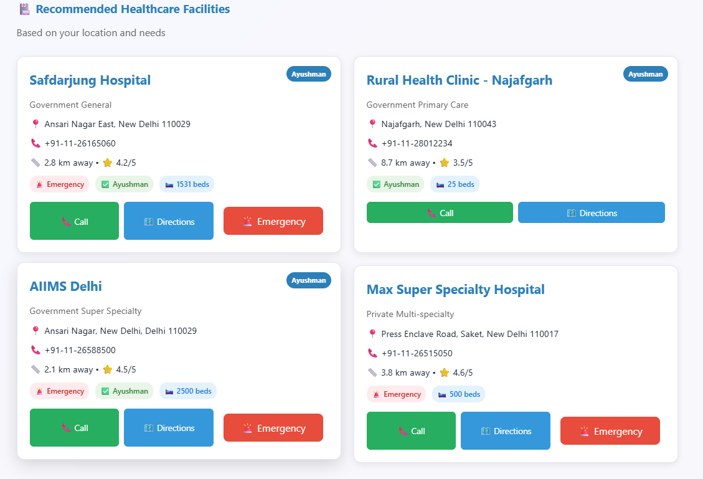
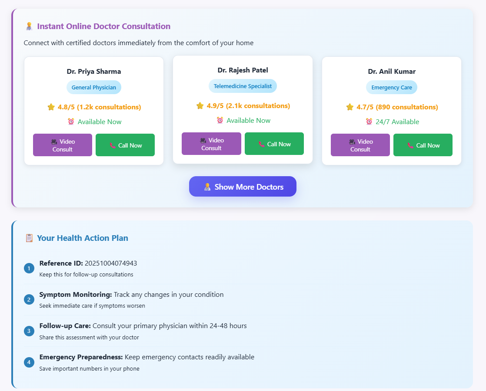
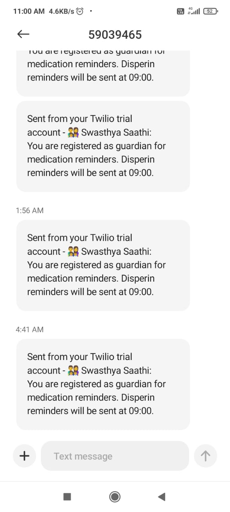
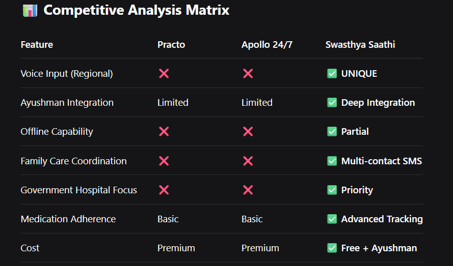

# 🏥 Swasthya Saathi - AI-Powered Healthcare Companion


<div align="center">


**Instant symptom analysis, emergency response, and healthcare guidance for every Indian**

*Voice-First • AI-Powered • Accessible Healthcare*


</div>

## 👥 Team Information

**Team Name:** Aryavarti  
**Team ID:** T140


### Team Members & Roles:
- **Manish Tiwari** - Backend Developer & AI Integration
  - Flask API development, Gemini AI integration, Hospital finder logic, JSON databases, API integration, Testing & deployment
- **Karuna Sharma** - Frontend Developer & UI/UX
  - Responsive web design, Voice interface, JavaScript functionality, Presentation
- **Bhavya Kochar** - Product Manager & Strategy
  - User research, Impact analysis, Scaling strategy, Presentation


## 🎯 Overview

Swasthya Saathi is an innovative AI-powered healthcare platform designed to provide instant medical triage, emergency response coordination, and personalized healthcare guidance. Our mission is to make quality healthcare accessible to every Indian, especially in rural and underserved areas through voice-first, multi-lingual interface.

``` 
Made with ❤️ for India's Healthcare Revolution by Team Aryavart - Hail Aryavart 
```


## 🚨 Problem Statement - HealthTech (Swasthya Saathi)

### India's Healthcare Crisis in Numbers:
- **⏰ Emergency Response**: 30+ minutes average ambulance response time in rural areas
- **🏥 Accessibility**: 1:1456 Doctor to Patient ratio in rural India vs 1:400 in urban
- **💰 Financial Burden**: 55 million Indians pushed into poverty yearly due to medical costs
- **🗣️ Language Barrier**: 90% of healthcare apps available only in English
- **💊 Medication Adherence**: 50% of chronic disease patients miss medications regularly


## 🛠️ Technology Stack

### Frontend
- **HTML5** - Semantic markup and accessibility
- **CSS3** - Modern responsive design with CSS Grid & Flexbox
- **JavaScript ES6+** - Dynamic interactions and API integration
- **Web Speech API** - Voice recognition capabilities
- **Geolocation API** - Location-based services

### Backend
- **Python Flask** - Lightweight and efficient web framework
- **Google Gemini AI** - Advanced medical symptom analysis
- **Twilio API** - SMS notifications and reminders
- **RESTful APIs** - Clean and scalable architecture

### Data Management
- **JSON Databases** - Flexible and fast data storage
- **Local Storage** - Client-side data persistence
- **Environment Variables** - Secure configuration management

## 🚀 Installation

### Prerequisites
- Python 3.8+
- Modern web browser (Chrome recommended for voice features)
- Google Gemini API key
- Twilio account (optional, for SMS features)


### Quick Start

1. **Fork & Clone the Repository**
   ``` Fork the repository from https://github.com/predictivemanish/swasthya-saathi.git``` 
   ```bash
   git clone https://github.com/<your-username>/swasthya-saathi.git
   cd swasthya-saathi
   ```
2. **Installing Dependencies & Running**
   ```
   pip install -r requirements.txt
   cd backend 
   python app.py
   ```
3. Testing

### Extra Details for proper working 
```
Credentials Required:
Google Gemini API Key - Get from Google AI Studio

Twilio Credentials - Account SID, Auth Token, Phone Number

Create an .env file and 
GEMINI_API_KEY=your_gemini_api_key_here
TWILIO_ACCOUNT_SID=your_twilio_sid
TWILIO_AUTH_TOKEN=your_twilio_token
TWILIO_PHONE_NUMBER=your_twilio_number

Add all the APIs for proper functioning otherwise it'll be working on Local JSON Database based classification
Note: Demo mode works without Twilio credentials
```
🏥 Healthcare Disclaimer

Important: Swasthya Saathi is an AI-powered healthcare assistant designed for guidance and triage purposes only. It is not a replacement for professional medical diagnosis, treatment, or emergency services. Always consult qualified healthcare providers for medical concerns and emergencies.


```
🙏 Acknowledgments
Google Gemini AI for advanced medical reasoning capabilities

Ayushman Bharat for government healthcare scheme integration

Twilio for reliable SMS communication services

Open Source Community for invaluable tools and libraries
```

## Project Visuals

<div align="center">

### Landing Page

*Modern, responsive landing page with feature overview*

### Symptom Analysis

*Voice and text input for symptom description*

### Results Dashboard

*AI analysis results with hospital recommendations*

### Medication Reminders

*Smart medication scheduling with SMS alerts*

### Hospital Finder

*Location-based hospital search with Ayushman filters*

### Doctor Consultancy & Action Plan

*Doctor Consultancy & Action Plan*

### Medication Reminder Message


*Medication Reminder Message Template*
</div>


### Uniqueness from Others

*Difference from pre-existing solutions*

### 🔧 File Descriptions

#### **Backend Files**
- **`app.py`** - Main Flask server with all API endpoints
- **`gemini_handler.py`** - Google Gemini AI integration for symptom analysis
- **`hospital_finder.py`** - Location-based hospital search with distance calculation
- **`ayushman_checker.py`** - Ayushman Bharat card validation and benefits
- **`data_manager.py`** - JSON data storage and session management
- **`notification_handler.py`** - Twilio SMS integration for reminders

#### **Frontend Files**
- **`index.html`** - Landing page with features and user registration
- **`symptoms.html`** - Symptom input page with voice and text options
- **`results.html`** - AI analysis results with hospital recommendations
- **`style.css`** - Complete styling with modern UI components
- **`main.js`** - Core application logic and API communication
- **`voice-input.js`** - Web Speech API integration for voice input

#### **Data Files**
- **`hospitals.json`** - Database of hospitals with locations and services
- **`ayushman_hospitals.json`** - Ayushman Bharat empaneled hospitals
- **`symptoms_db.json`** - Medical symptom patterns and emergency indicators
- **`medications.json`** - Common medicines and dosage information
- **`triage_history.json`** - User session history and analytics
- **`users.json`** - User profiles and preferences

### 🗂️ Directory Purpose

- **`backend/`** - Complete server-side logic and AI processing
- **`frontend/`** - Client-side web application with responsive design
- **`data/`** - All JSON databases and configuration files
- **`assets/`** - Images and media files for documentation

This architecture ensures clean separation of concerns, easy maintenance, and scalable development.

# 🌟 Star History
https://api.star-history.com/svg?repos=predictivemanish/swasthya-saathi&type=Date